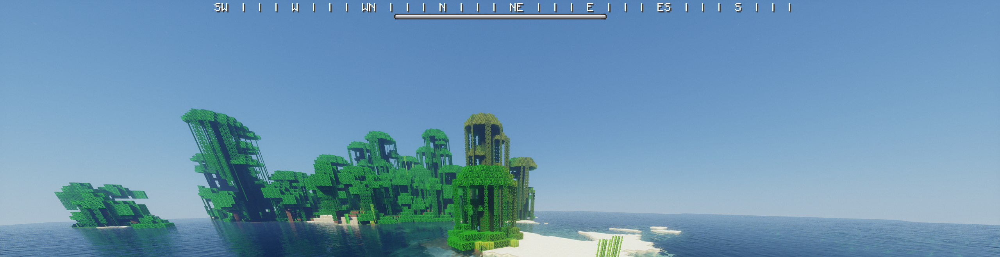

# CompassBar

A Minecraft plugin that display a compass as a bossbar.

## Commands

`/compass` Toggles the compass bar

## Installation

Make sure you have a spigot server. Download the jar file from release and place it in `plugins/`.